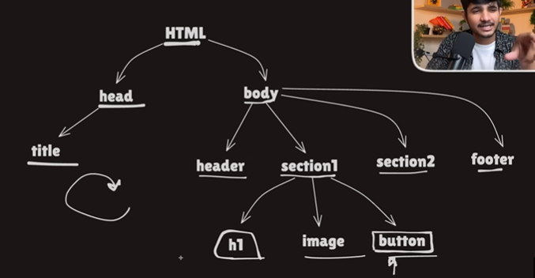

1. What is React JS 
Its a JS library used for UI made by Meta in 2013

2. When users increased in facebook it faced problems like when you sent any message to some one or anything we had to reload the entire page to see the updated screen so this reloading was bad UX so they came up with "component based architecture" means when notification comes only it gets reloads not entire page

3. jordan was founding member of React JS

4. library are used to give a particular feature 
        - GSAP
        - Lenis
        - Reat JS

5. Framework
        - Next Js
        - Angular

6. A library is a collection of reusable code that the developer calls whenever needed. A framework is a complete structure for building applications where the framework controls the flow of the program and calls the developer's code. This concept is called Inversion of Control (IoC)

7. Library: You call it.
   Framework: It calls you.

Imort and Export

8. there are 2 types of exports

    - named (A named export lets you export multiple variables, functions, or classes from the same file.)

    example:

    // math.js
    export const add = (a, b) => a + b;
    export const subtract = (a, b) => a - b;

    // app.js
    import { add, subtract } from "./math.js";

    - default (A default export is used when a file exports one main value. While importing, you can choose any name.) 

    example:

    // greet.js
    export default function greet() {
    console.log("Hello");
    }

    // app.js
    import greet from "./greet.js";
    // or
    import anything from "./greet.js";

9. Real DOM vs Virtual DOM

Real DOM

When i clicked a button and want to change H1 from the real DOM but when i change everything gets Rerender and how page realoads for every small change

Virtual DOM:

The Virtual DOM is not an actual copy of the Real DOM. It is a lightweight JavaScript object that represents what the UI should look like. When the application's state or props change (often because of a user action), React creates a new Virtual DOM. It then compares the new Virtual DOM with the previous Virtual DOM using a diffing algorithm. After finding the differences, React updates only the changed parts of the Real DOM instead of re-rendering the entire page.